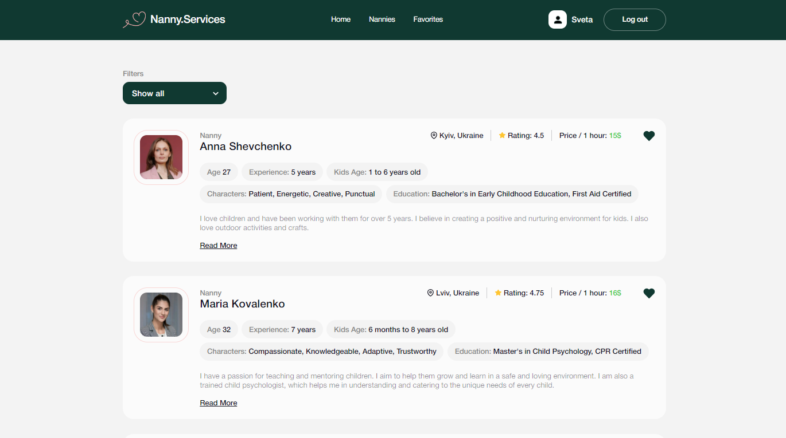

<h1 align="center">
   
  
   
Nanny services
   
</h1>

Find your nanny with our service. Easy filtering, ability to add to favorites
and quickly fill out an application.

## Technology:

- React
- React-dom
- React-responsive
- React-select
- Firebase
- Redux Toolkit
- Redux Persist
- Formik
- react-hot-toast
- Styled-components
- Yup

## Scripts:

| LEFT          | RIGHT                   |
| ------------- | ----------------------- |
| npm i         | dependency installation |
| npm run start | start local server      |
| npm run build | production build        |

[Link to site](https://svitlanaparyiska.github.io/nanny-services/ 'Nanny Services')
[Link to Figma layout](https://www.figma.com/file/u36ajEOsnwio2GDGiabVPD/Nanny-Sevices?type=design&node-id=0-1&mode=design&t=CZpMnnOCRwAYc81O-0 'Figma Nanny Services')

